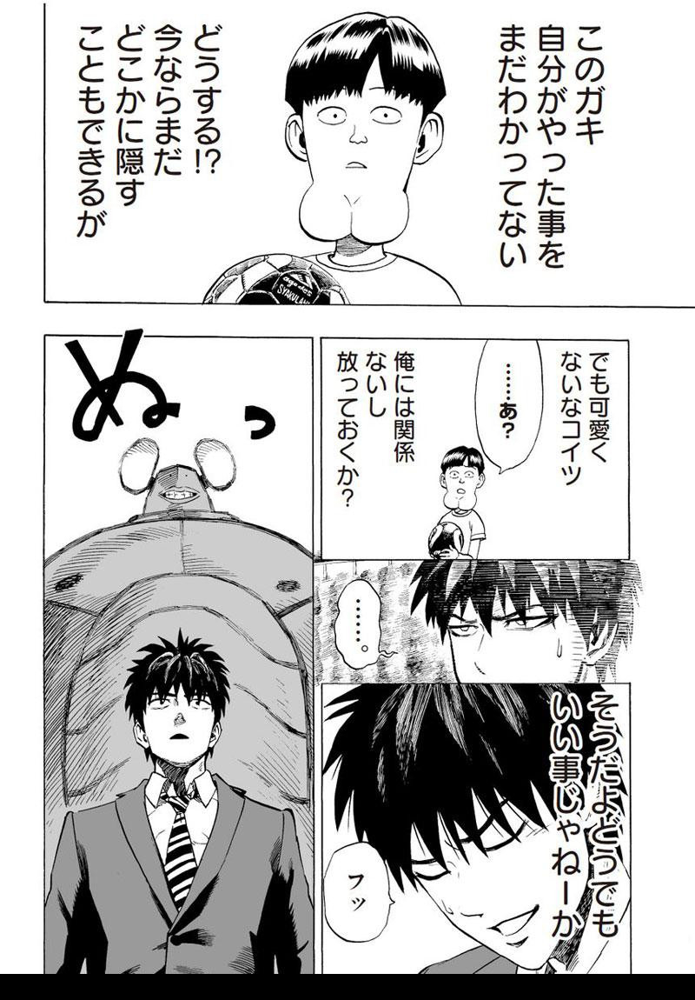
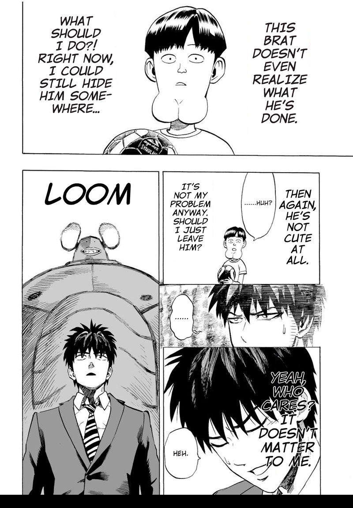

<p align="center">
  <a href="../../../README.md">English</a> |
  <a href="../zh/README.md">简体中文</a> |
  <a href="../ko/README.md">한국어</a> |
  <a href="README.md">日本語</a>
</p>

<h1 align="center"><b>MangaTranslator</b></h1>

<p align="center">
  
  
  
  
</p>

<div align="center">
AIを活用してマンガ、Webtoon（Manhwa）、アメコミなどの翻訳を行うエンドツーエンドのパイプラインです。吹き出し内外のテキストを検出し、拡散モデルによるインペインティングで原文を消去、LLMとカスタムフォントを用いて60以上の言語へ自動で組版・翻訳します。
</div>

<br/>

<div align="center">
  <table>
    <tr>
      <th style="text-align: center">オリジナル</th>
      <th style="text-align: center">翻訳後（ワンクリック）</th>
    </tr>
    <tr>
      <td></td>
      <td></td>
    </tr>
  </table>
</div>

---

## クイックスタート

### 1. ダウンロード

- **ポータブルパッケージ（推奨）：** [Releases](https://github.com/meangrinch/MangaTranslator/releases/tag/portable) からポータブルビルドをダウンロードします。
  - *Windows：* 事前準備は不要です。
  - *Linux / macOS：* Python 3.10以上およびGitが必要です。
- **ソースからインストール：**
  ```bash
  git clone https://github.com/meangrinch/MangaTranslator.git
  cd MangaTranslator
  python -m venv venv
  # 仮想環境の有効化：.\venv\Scripts\activate (Windows) または source venv/bin/activate (Linux/macOS)
  pip install -r requirements.txt
  ```

### 2. 設定

- **プロバイダー：** Web UIの Config → Translation 画面でLLMプロバイダー（Google、OpenAI、Anthropic、DeepSeekなど）を選択してAPIキーを入力するか、ローカルのOpenAI互換エンドポイント（llama.cppなど）を使用します。「Save Config」をクリックすると設定がセッションを越えて保持されます。
- **吹き出し外テキスト（任意）：** Config → OSB Text 画面で [deepghs/AnimeText_yolo](https://huggingface.co/deepghs/AnimeText_yolo) へのアクセス権を持つHugging Faceトークンを設定します。
- **環境変数：** Web UIとCLIの両方で利用できるよう、環境変数（`GEMINI_API_KEY`、`HF_TOKEN` など）に認証情報を設定することも可能です。

*詳細については [設定](CONFIGURATION.md) を参照してください。*

### 3. 翻訳

- **Web UI：** Translator/Batchタブに画像をアップロードし、「Translate」をクリックします。
- **CLI：**
  ```bash
  python main.py --input "path/to/page.jpg" --input-language "Japanese" --output-language "English" --font-dir "fonts/Komika Hand" --provider Google --google-api-key <...> --osb-enable --osb-font-dir "fonts/Comicka" --osb-hf-token <...>
  ```
*その他の使用例については [CLI](CLI.md) を参照してください。*

---

## 主な機能

- **検出**：吹き出しおよび吹き出し外テキストの検出（YOLO、SAM 2.1/3）
- **消去**：吹き出し内および背景テキストのインペインティング消去（FLUX.2 Klein、FLUX.1 Kontext、またはOpenCV）
- **翻訳**：60以上の言語に対応したOCRと翻訳（クラウドAPIまたはローカルLLM）
- **描画**：文字揃え、自動改行、カスタムフォントパックに対応したテキストレンダリング
- **アップスケーリング**：テキスト領域およびページ全体のイラストの高解像度化（2x-AnimeSharpV4）
- **処理**：フォルダ構造を保持した単一画像、フォルダ、ZIPアーカイブの一括バッチ処理
- **設定**：多様なページレイアウトに対応し、出力品質を微調整できる柔軟な設定項目
- **インターフェース**：Web UI (Gradio) および CLI
- **自動化**：ワンクリック翻訳、手動操作は不要

---

## ドキュメント

- [ハードウェア要件](HARDWARE_REQUIREMENTS.md)
- [インストール](INSTALLATION.md)
- [設定](CONFIGURATION.md)
- [CLI](CLI.md)
- [フォント](FONTS.md)
- [トラブルシューティング](TROUBLESHOOTING.md)

---

## プロジェクトの支援

MangaTranslatorはオープンソースで無料です。作業時間の短縮や読書体験の向上に役立ちましたら、ぜひ開発の支援をご検討ください！

<p align="center">
  <a href="https://ko-fi.com/grinnch" target="_blank">
    
  </a>
</p>

---

## ライセンスとクレジット

- ライセンス：Apache-2.0（[LICENSE](../../../LICENSE) を参照）
- 作者：[grinnch](https://github.com/meangrinch)

<details>
<summary><b>ML モデルと関連ライブラリ</b></summary>

- YOLOv8m Speech Bubble Detector: [kitsumed](https://huggingface.co/kitsumed/yolov8m_seg-speech-bubble)
- Manga109 Speech Bubble Detector: [huyvux3005](https://huggingface.co/huyvux3005/manga109-segmentation-bubble)
- Comic Text and Bubble Detector RT-DETR-v2: [ogkalu](https://huggingface.co/ogkalu/comic-text-and-bubble-detector)
- Manga109 YOLO: [deepghs](https://huggingface.co/deepghs/manga109_yolo)
- AnimeText YOLO: [deepghs](https://huggingface.co/deepghs/AnimeText_yolo)
- SAM 2.1: [Meta AI](https://huggingface.co/facebook/sam2.1-hiera-large)
- SAM 3: [Meta AI](https://huggingface.co/facebook/sam3)
- Manga OCR: [kha-white](https://github.com/kha-white/manga-ocr)
- PaddleOCR-VL-1.6: [PaddlePaddle](https://huggingface.co/PaddlePaddle/PaddleOCR-VL-1.6)
- FLUX.1 Kontext: [Black Forest Labs](https://huggingface.co/black-forest-labs/FLUX.1-Kontext-dev)
- FLUX.2 Klein 4B: [Black Forest Labs](https://huggingface.co/black-forest-labs/FLUX.2-klein-4B)
- FLUX.2 Klein 9B: [Black Forest Labs](https://huggingface.co/black-forest-labs/FLUX.2-klein-9B)
- Nunchaku: [Nunchaku AI](https://github.com/nunchaku-ai/nunchaku)
- SDNQ Quants: [Disty0](https://huggingface.co/Disty0)
- Unsloth Quants: [Unsloth](https://huggingface.co/unsloth)
- stable-diffusion.cpp: [leejet](https://github.com/leejet/stable-diffusion.cpp)
- 2x-AnimeSharpV4: [Kim2091](https://huggingface.co/Kim2091/2x-AnimeSharpV4)

</details>
